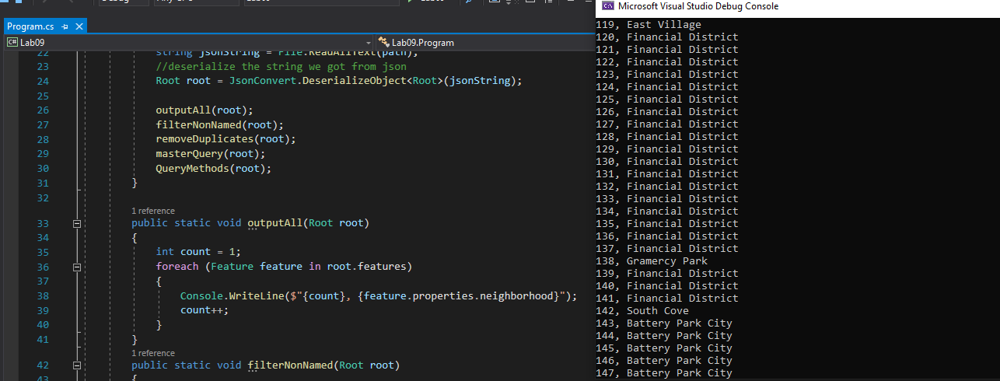
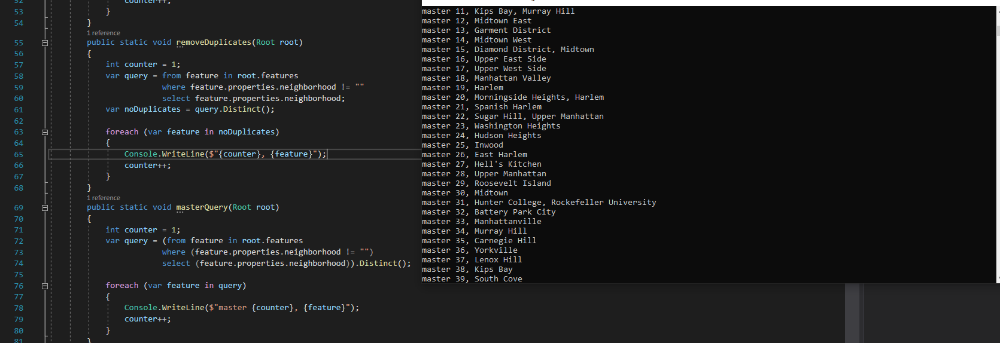

# Lab09

**Author**: Matthew Petersen
**Version**: 1.0.0 

## Overview
LINQ principles. Utilizing a given .json file, translate the information into an object and query those objects to find specific details.

## Getting Started
Clone the repository down to your local machine with: Git clone clonedRepoHere
Enter VSC and view all of our beautiful tests!
(tomorrow I presume we will be making this work in the console)

## Example

You can see the differences between how we queried these two images. One query was less specific, showing all 147 different neighborhoods. While the other query we were very specific, only seeking non-duplicate or empty neighborhood strings.

## Architecture
C# + VSC with some inheritance!

## LINQ
LINQ is an amazing tool that allows developers to query things! This is useful in this example because we are given a .json file and need to find specific details about it. First we find the path of the .json file and utilize a file reader on the path. We start by de-serializing the object into my Root class. This now gives us the information we need to start querying. 

## Change Log
01/18/2021 - initial upload of the lab! Stay tuned for more.

1/19/2021 - New repository created, prior repo had incorrect file structure which broke after cloning. Unsure why this break happened, but it seems to be resolved.
